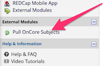
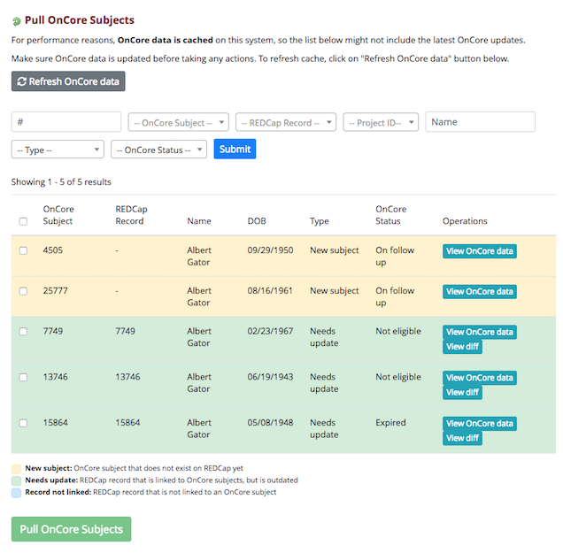

# REDCap OnCore Client

[](https://zenodo.org/badge/latestdoi/115017273)

This REDCap external module provides integration with Forte Research's OnCore. It allows REDCap project builders to associate a REDCap project with an OnCore protocol and import enrollment data into REDCap. It also allows users to select protocols via either the SIP interface or UF's OCR API, and read protocol data from OnCore via the SOAP API.

## Current Limitations

* Mapped fields are best configured as text fields with no validation in your REDCap project to prevent synchronization failures on that project.

## Prerequisites
- REDCap >= 9.0.1
- [PHP SOAP](http://php.net/manual/en/book.soap.php)
- [REDCap Entity](https://github.com/ctsit/redcap_entity) >= 2.3.0

The UF OCR API for OnCore, https://github.com/UF-OCR/ocr-api, is recommended as it can provide access to protocols that are not yet enrolling. This allows configuration and testing before a protocol starts enrolling subjects. The `ocr-api` must be deployed as a service within the OnCore infrastructure. For details on how to do this see https://github.com/UF-OCR/ocr-api.

## Easy installation
- Install the _REDCap Entity_ module from the Consortium [REDCap Repo](https://redcap.vanderbilt.edu/consortium/modules/index.php) from the control center.
- Install the _REDCap OnCore Client_ module from the Consortium [REDCap Repo](https://redcap.vanderbilt.edu/consortium/modules/index.php) from the control center.
- Go to **Control Center > External Modules**, enable REDCap Entity, and then OnCore Client. REDCap Entity will be enabled globally, but the OnCore client has to be enabled on a per-project basis after *Global Configuration* is completed.

## Manual Installation
- Clone this repo into to `<redcap-root>/modules/redcap_oncore_client_v0.0.0`.
- Clone [redcap_entity](https://github.com/ctsit/redcap_entity) repo into `<redcap-root>/modules/redcap_entity_v0.0.0`.
- Go to **Control Center > External Modules**, enable REDCap Entity, and then OnCore Client. REDCap Entity will be enabled globally, but the OnCore client has to be enabled on a per-project basis after *Global Configuration* is completed.


## Global Configuration
Go to **Control Center > External Modules**, click on OnCore Client's configure button, and fill the configuration form with your credentials and other details. Contact your site's OnCore team to get the URLs, usernames and passwords required to configure this module.

- **WSDL**: The OnCore WSDL URL, e.g. `https://example.edu/opas/OpasService?wsdl`
- **Login**: Your OnCore client user ID
- **Password**: Your OnCore client password
- **Protocol lookup method**: The method through which protocols are acquired from OnCore (SIP or UF OCR API) - _one_ of these is required to associate projects with protocols
- **SIP URL**: The URL of OnCore SIP (Study Information Portal), e.g. `https://example.edu/sip/SIPMain`. Returns **only** protocols open to enrollment
- **OCR API URL**: The URL of UF OCR OnCore API (Application Programming Interface), e.g. `https://example.edu/ocr/api/protocols`. Returns **all** protocols, requires UF OCR API credentials
  - **OCR API Username**: Your UF OCR OnCore API user name
  - **OCR API Key**: Your UF OCR OnCore API key
- **Log requests**: Check this field to log all API requests (see Logs Page section) - this is useful for development purposes and testing
- **Store User Institution IDs in REDCap User Attributes or Entity database?**: The Oncore client needs a user's Institutional ID to identify them in OnCore data. Choose whether this data will be stored in and read from REDCap's built-in attribute or in a side table managed by REDCap Entity.
- **Auto-populate Institution ID from server?**: If you use an authentication mechanism that provides the institutional ID in a server environment variable, the OnCore Client can automatically write that value to the lookup tables it uses to verify access. Note that this feature will overwrite the storage location selected in _Store User Institution IDs in REDCap User Attributes or Entity database?_.
- **Name of server variable used to populate Institution ID**: If you use the _Auto-populate Institution ID from server?_ feature, name the variable that holds the Institution ID here.


### Institutional IDs

The REDCap OnCore Client displays enrollment data only to REDCap users who are on OnCore's list of protocol staff. To do this, it reads the protocol staff list from OnCore and compares the institional ID of the logged-in REDCap user against the institional ID field in the OnCore study staff data. If there is a match, it displays the enrollees, otherwise it hides them. Note that REDCap super-users can always see the list of enrollees. 

To do the comparison, REDCap needs to know the institutional ID for the logged-in user. If you use an authentication mechanism that provides the institutional ID in a server environment variable, the OnCore Client can automatically write that value to the lookup tables it uses to verify access. Sites that use Shibboleth or LDAP for authentication are likely to have this functionality, but its implementation is site-specific. Whether your site provides an institutional for successfully-authenticated staff and what variable would hold that value are questions for your site's system staff.

Additionally, admins can configure the storage location the OnCore Client will use for the institutional ID. It can be read from REDCap's Institution ID field of the User Attributes or from a side table managed by the OnCore Client via REDCap Entity. If you already have the correct data in the REDCap User Attributes, just use that field. If you have other data in REDCap User Attributes, use the Entity database to store the Institutional ID. The auto-population feature can populate which every storage location you choose.

If you are not using the auto-population feature, you will need to provide that ID for each user to allow them to access the protocol data. If you chose to store the Institution ID in the REDCap User Attributes, simply update that page. If you chose to use the Entity database, set the Institutional ID at **Control Center > Enter User Institution IDs**. Users will _only_ be allowed to access protocol subject data if OnCore lists them as currently active staff on a protocol or if they have Super User privileges.

Note that the institutional ID used on your site's OnCore system is a site-specific decision. It could be the same ID as the REDCap username or some other ID unique to each staff member. Ask your OnCore team which person identifier they store in the institutional ID field. 


## Project level configuration

If you already set a valid SIP URL or API credentials, you may associate a project with a protocol.

To do that, access the **External Modules** section of your project, make sure OnCore Client is enabled, and then click on its configure button.


On this page you _must_ select a protocol, check at least one enrollment status, the event to map on and the REDCap field name where the OnCore PrimaryIdentifier will be stored. You have the option of mapping other OnCore demographic fields to REDCap fields as well.

When specifying the field mapping, we strongly recommend you only map fields OnCore Fields to  REDCap fields that are defined as free text fields with no validation. If you do map OnCore fields to REDCap fields that use validation, the OnCore data must match the REDCap validaiton rules precisely. Failing to do so will cause records to not synchronize and you will be notified of the fields causing conflict. Documenting the OnCore field encoding is outside the scope of this document at this time.

All that said, there is bug in the OnCore API that returns the ethnicity as a coded value instead of the human-friendly label. These are the codes returned from Oncore and their corresponding labels:

| Code  | Description        |
| ----  | ------------------ |
| 3163  | Hispanic or Latino |
| 3164  | Non-Hispanic       |
| 15519 | Subject Refused    |
| 3165  | Unknown            |

If you want ethnicity data from OnCore to display with labels in REDCap, make ethnicity a radio button field with these codes:

```
3163,Hispanic or Latino
3164,Non-Hispanic
15519,Subject Refused
3165,Unknown
```

To prevent modification of fields that should be set by the OnCore Client, add the @READONLY action tag to the fields. The @READONLY action tag will prevent modification of the those fields via REDap forms, but will still allow the OnCore client to set them.

Note also that while the OnCore client supports non-longitudinal projects, the event name _must_ still be specified.

## REDCap Record ID

The OnCore Client will set a REDCap Record ID for any record it creates. If no field is mapped to Record ID in the field mapping, the OnCore Client will generate an automatic number incrementing the highest record ID in the system.

You have the option of mapping any field in OnCore to REDCap's Record ID. Note that when mapping OnCore fields to Record ID, REDCap records will be **overwritten** if a field contains a non-unique value or rejected if a field contains no data; uniqueness of the field mapped to Record ID is **neither checked nor enforced** by the OnCore Client. You are expected to use a field with unique values (a good option is SequenceNumber _if it is provided for every subject_).

## Synch OnCore subjects

You can use the `Pull OnCore Subjects` feature to copy enrollees into REDCap from the OnCore enrollment records.



The same feature can update fields in REDCap that do not match the data in OnCore. The interface uses color queues to show which records subjects are only in OnCore (yellow), which records are in REDCap *and* Oncore but have mis-matched data (green) and which REDCap records are not linked to an OnCore subject (blue).



The data synchronization work has to be done on a regular basis by study staff as new subjects are enrolled. Make sure to press `Refresh OnCore data` at the beginning of a synch session. You can view the data relevant OnCore data for each record by pressing `View OnCore data` or see the difference between two records by pressing `View Diff`.

Select the records you want to synchronize, then press `Pull OnCore Subjects` bring those OnCore records and fields into REDCap. As you synchronize enrollees, they will disappear from the list. When the list is empty, your REDCap data is in synch with your OnCore data.


### Supported services
This module is still under construction so the supported operations so far are:

- `getProtocol`
- `getProtocolSubjects`
- `getProtocolStaff`
- `createProtocol`
- `registerNewSubjectToProtocol`
- `registerExistingSubjectToProtocol`

## Logs page
You may track your API calls by accessing the logs page. Go to **Control Center** and click on **OnCore Logs** at the left menu.


You may clear the logs by clicking on **Clean logs** button.

## Developer notes

If you want extend the OnCore client to support other OnCore data types, you might find the [Developer's Notes](README-developer.md) helpful.
