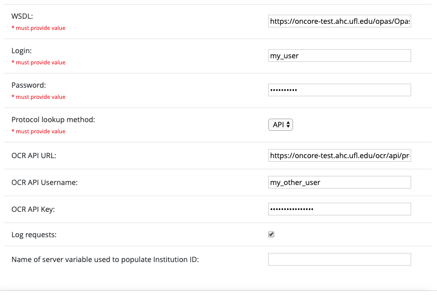
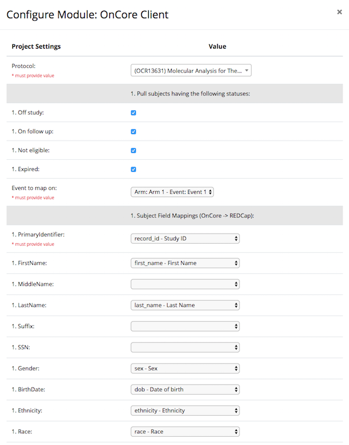
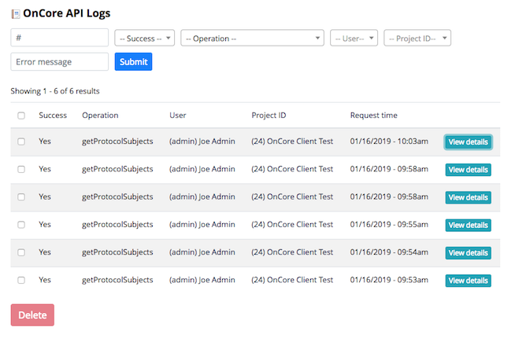
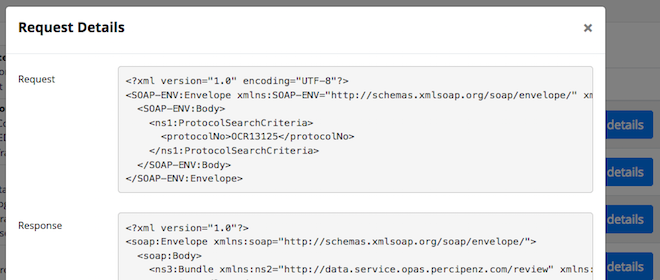

# REDCap OnCore Client
This REDCap external module provides integration with Forte Research's OnCore. It allows REDCap project builders to associate a REDCap project with an OnCore protocol and import enrollment data into REDCap. It also allows developers to read data from OnCore via the SIP interface or the SOAP API.

## Current Limitations

* Mapped fields are best configured as text fields with no validation in your REDCap project to prevent synchronization failures on that project.

## Prerequisites
- REDCap >= 8.7.0
- [PHP SOAP](http://php.net/manual/en/book.soap.php)
- [REDCap Entity](https://github.com/ctsit/redcap_entity) >= 2.1.0


## Manual Installation
- Clone this repo into to `<redcap-root>/modules/redcap_oncore_client_v0.0.0`.
- Clone [redcap_entity](https://github.com/ctsit/redcap_entity) repo into `<redcap-root>/modules/redcap_entity_v0.0.0`.
- Go to **Control Center > External Modules**, enable REDCap Entity, and then OnCore Client. REDCap Entity will be enabled globally, but the OnCore client has to be enable on a per-project basis.


## Global Configuration
Go to **Control Center > External Modules**, click on OnCore Client's configure button, and fill the configuration form with your credentials.

- **WSDL**: The OnCore WSDL URL, e.g. `https://oncore-test.ahc.ufl.edu/opas/OpasService?wsdl`
- **Login**: Your OnCore client user ID
- **Password**: Your OnCore client password
- **Protocol lookup method**: The method through which protocols are acquired from OnCore (SIP or API) - _one_ of these is required to associate projects with protocols
- **SIP URL**: The URL of OnCore SIP (Study Information Portal), e.g. `https://oncore-test.ahc.ufl.edu/sip/SIPMain`. Returns **only** protocols open to enrollment
- **OCR API URL**: The URL of OnCore API (Application Programming Interface), e.g. `https://oncore-test.ahc.ufl.edu/ocr/api/protocols`. Returns **all** protocols, requires API credentials
  - **OCR API Username**: Your OnCore API user name
  - **OCR API Key**: Your OnCore API key
- **Log requests**: Check this field to log all API requests (see Logs Page section) - this is useful for development purposes and testing



You will also need to provide the institution ID (e.g. an 8 digit UFID) for each user for them to access the protocol data. This is available at **Control Center > Enter User Institution IDs**. Users will _only_ be allowed to access protocol subject data if OnCore lists them as currently active staff on a protocol.

## Project level configuration

If you already set a valid SIP URL or API credentials, you may associate a project with a protocol.

To do that, access the **External Modules** section of your project, make sure OnCore Client is enabled, and then click on its configure button.



On this page you _must_ select a protocol, check at least one enrollment status, the event to map on and the REDCap field name where the OnCore PrimaryIdentifier will be stored. You have the option of mapping other OnCore demographic fields to REDCap fields as well.

When specifying the field mapping, we strongly recommend you only map fields OnCore Fields to  REDCap fields that are defined as free text fields with no validation. If you do map OnCore fields to REDCap fields that use validation, the OnCore data must match the REDCap validaiton rules precisely. Failing to do so will cause records to not synchronize and you will be notified of the fields causing conflict. Documenting the OnCore field encoding is outside the scope of this document at this time.

All that said, there is bug in the OnCore API that returns the ethnicity as a coded value instead of the human-friendly label. These are the codes returned from Oncore and their corresponding labels:

| Code  | Description        |
| ----  | ------------------ |
| 3163  | Hispanic or Latino |
| 3164  | Non-Hispanic       |
| 15519 | Subject Refused    |
| 3165  | Unknown            |

If you want ethnicity data from OnCore todisplay with labels in REDCap, make ethnicity a radio button field with these codes:

```
3163,Hispanic or Latino
3164,Non-Hispanic
15519,Subject Refused
3165,Unknown
```

To prevent modification of fields that should be set by the OnCore Client, add the @READONLY action tag to the fields. The @READONLY action tag will prevent modification of the those fields via REDap forms, but will still allow the OnCore client to set them.

Note also that while the OnCore client supports non-longitudinal projects, the event name _must_ still be specified.


## Synch OnCore subjects

You can use the `Pull OnCore Subjects` feature to copy enrollees into REDCap from the OnCore enrollment records.


The same feature can update fields in REDCap that do not match the data in OnCore. The interface uses color queues to show which records subjects are only in OnCore (yellow), which records are in REDCap *and* Oncore but have mis-matched data (green) and which REDCap records are not linked to an OnCore subject (blue).


The data synchronization work has to be done on a regular basis by study staff as new subjects are enrolled. Make sure to press `Refresh OnCore data` at the beginning of a synch session. You can view the data relevant OnCore data for each record by pressing `View OnCore data` or see the difference between two records by pressing `View Diff`.

Select the records you want to synchronize, then press `Pull OnCore Subjects` bring those OnCore records and fields into REDCap. As you synchronize enrollees, they will disappear from the list. When the list is empty, your REDCap data is in synch with your OnCore data.


### Supported services
This module is still under construction so the supported operations so far are:

- `getProtocol`
- `getProtocolSubjects`
- `getProtocolStaff`
- `createProtocol`
- `registerNewSubjectToProtocol`
- `registerExistingSubjectToProtocol`

## Logs page
You may track your API calls by accessing the logs page. Go to **Control Center** and click on **OnCore Logs** at the left menu.




You may clear the logs by clicking on **Clean logs** button.

## Developer notes

If you want extend the OnCore client to support other OnCore data types, you might find the [Developer's Notes](README-developer.md) helpful.
